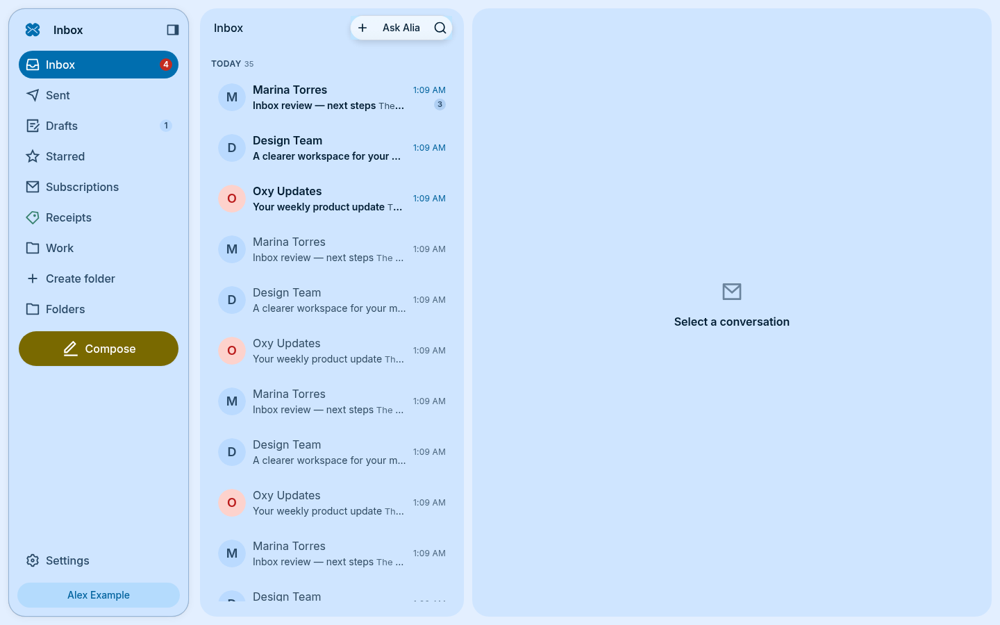
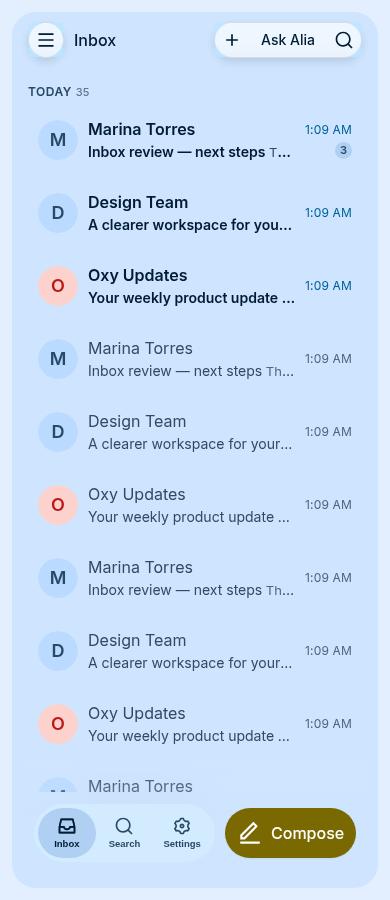

# Inbox UI migration to Bloom

Inbox uses one responsive Expo tree for web and Android. Mail is the primary
workspace; the brief and Alia open on demand.

## Component ownership

| Surface | Shared Bloom primitives | Inbox responsibilities |
| --- | --- | --- |
| Workspace | AiChatShell, AiChatContainer, AppShellSplitPanes, Sidebar, BottomBar, Fab | Mailbox/label destinations and SDK account actions |
| Mail list | MailRow, MailSelectionBar, SwipeRow | Virtualization, grouping, unreadable rows, bulk mutations and preferences |
| Conversation | PageHeader, MailThread, MailMessage | Safe HTML/CID resolution, unreadable entries, downloads, reply targets |
| Composer | MailComposeSurface, MailRecipientField, TextFieldInput | Recipient validation/suggestions, editor, draft recovery, RFC reply headers and outbound queue |
| Settings | SettingsModal and its page/row templates | Existing preferences, forms, mutations and bookmarked route compatibility |
| Search | Search, Chip, EmptyState, Loading | Local operators, opt-in inference, saved/recent searches and pagination |

The custom drawer, tab bar, settings navigation, floating-header hook, row
density geometry and independent color palette are removed. Structured mail
cards and the HTML editor remain domain-specific; neither is reimplemented by
this migration. Colors now come from semantic Bloom roles.

## State and navigation

- The workspace uses the same Bloom composition as Alia: `AiChatShell`,
  one `AiChatContainer` per pane, a default `Sidebar` in flow and a `mobile surface="plain"`
  copy in the reveal drawer. Bloom owns margins, surfaces, rounding, the
  reveal animation, swipe gestures, dismissal and focus behavior.
- The split primitive's `variant="separated"` gives the list and detail their
  own rounded Bloom containers, with a Bloom-owned 12px gutter between them.
  The existing resize handle sits in that gutter. There is no shared outer
  card, app-defined border/radius, or custom divider. A solo mobile pane has
  no inter-panel gutter.
- At Bloom's `lg` breakpoint (1024px), `AppShellSplitPanes` keeps the list
  beside the routed conversation/composer. Its shared divider is adjustable
  from 320–480px, initially 380px. Below `lg`, index routes render the list
  and conversation routes render the message in the same detail slot. The
  navigator stays mounted, preserving open drafts through a width change.
- `PageHeader` and `ButtonGroup` follow Alia's inline chrome: no scrim, no
  sticky header or app-owned surface. Routes remain transparent, each pane
  owns its scrolling, and the mobile `BottomBar` sits in the container slot.
- Search state lives above the route stack. Its lifetime is
  scoped to the SDK user ID; switching accounts or signing out clears it.
  Outstanding interpretation/debounce callbacks cannot update a new session.
- Bloom stores scroll offsets under account + mailbox/search identity. The
  shell's current detail route is deliberately not part of the list identity.
- A completed swipe still executes the configured mail action. Disabling a
  direction leaves it inert. Selection keeps the same bulk mutations.
- Recipient fields retain incomplete input on every keystroke, including Cc
  and Bcc, so validation and local draft recovery see what the user typed.
- Existing `/settings/*` URLs open the matching Bloom settings page. Opening
  settings from the normal navigation preserves the current mail/compose route.

## Surface and inset ownership

`AiChatShell safeArea` consumes native device insets once for the workspace and
reveal drawer. Its bottom-slot context prevents the mobile bar adding the same
inset again; the original device context remains available to portaled dialogs.
Web geometry is unchanged. Inner `PageHeader` instances opt out with
`safeArea={false}`. Inbox has no per-screen `useSafeAreaInsets`, `SafeAreaView`,
or tab-bar-clearance helper.

Mailbox, search, subscriptions, conversation, compose and not-found routes all
inherit the Bloom panel's surface. The router scenes are transparent.
`MailComposeSurface variant="sheet"` inherits the parent fill instead of drawing
another panel. The HTML message host is transparent too; sender-provided email
formatting and the printable document retain their own content styling.

Custom touch targets and painted controls were replaced with Bloom cards,
chips, empty states, accordion, keyboard keys, avatars and buttons. The editor
uses `NoteEditorToolbar`, a Bloom link dialog and native `Textarea`. Mail parsing,
mutations, safe HTML rendering and the web editable-document engine stay in Inbox:
Bloom explicitly exposes the compose body as a slot rather than a rich-text engine.
Content grouping still uses ordinary flex containers and NativeWind spacing;
it does not recalculate panel margins, surfaces or safe areas.

## Shared library dependency

Bloom PR [#234](https://github.com/OxyHQ/Bloom/pull/234) supplies `cozy` density
and `showAvatar` while preserving existing defaults. It also fixes settings
keyboard dismissal/focus using Bloom's existing modal keyboard primitive.
The 4.34.2 patch also fixes MailRow pointer hit testing: inert visual content
passes clicks to the row action, while selection, star and archive controls
remain independent. Real browser pointer tests cover all three densities.
The shared fix is tracked in [Bloom #242](https://github.com/OxyHQ/Bloom/pull/242).
Bloom [#243](https://github.com/OxyHQ/Bloom/pull/243) exposes the existing split-pane
primitive for composition inside Alia’s shared shell, without an app-owned
layout or a second shell context. Version 4.34.4 adds its separated-panel
variant; the default joined layout remains unchanged. Version 4.34.5 adds
opt-in shell safe-area ownership, container fill inheritance, and the missing
editor glyphs used by `NoteEditorToolbar`.
Both manifests and `bun.lock` pin the published maintenance release **4.34.5**.
Validation uses a clean registry installation, with no local package copy or patch.
The maintenance releases use npm's `inbox-maintenance` tag, preserving
`latest` (4.35.0 when 4.34.1 shipped; 5.1.1 for 4.34.2; 5.2.0 for 4.34.3). [Bloom PR #234](https://github.com/OxyHQ/Bloom/pull/234) carries the
additive changes forward separately.

The Doctor wrapper uses the published `@oxy.so/doctor` inspection API. It reports
one explicit deferral: Bloom's 4.35.0 update, while the frontend declaration,
root override and sole locked version are exactly 4.34.5. All other findings
still fail CI, including a newer registry release, changed pin or duplicate
installation. Remove this narrow exception when adopting the next Bloom release;
that update needs separate compatibility review. Tests cover the fail-closed
conditions. This keeps the approved maintenance release isolated without claiming
compatibility with the unrelated 4.35.0 changes.

## Validation

The local validation run passed 34 Jest suites (168 tests), lint and TypeScript.
The web export emits 60,365 bytes of CSS (above the 20 KB floor), and the post-export TypeScript check
also passed. The final registry export passed with `--max-workers 2` after the
default-worker Node process segfaulted during export. The previous layout revision was smoke-tested in a locally compiled
Android client. This cleanup is checked by Android export and Bloom's simulated
iOS/Android inset regressions; it has not been exercised on a physical device.

The Jest suite covers recipient draft preservation, existing composer/reply and
HTML safety, account-scoped search retention, mailbox navigation, settings deep
links/account handoff, bottom navigation and swipe action dispatch. Run
`bun run test`, never `bun test`.

Local browser fixtures use the real `InboxList`/FlashList, Bloom shell and mail
components with mocked mail/account hooks. The mailbox now has a Bloom PageHeader
and one shared content width for its header, controls and rows. They verify 390/900/1023/1024/1440px layouts, pointer navigation with the list retained beside the conversation on wide screens, light/dark modes,
recipient/subject preservation on resize, and scroll restoration. The reveal drawer
is checked by pointer opening, Escape and veil dismissal, including the actual
272px workspace translation. These are
UI checks, not authenticated mail-delivery end-to-end tests. A second fixture
renders the migrated controls and verifies editor selection/formatting/link
insertion, unreadable-message retry/original actions, summary collapse, saved
search activation and reminder dismissal. Wide and narrow layouts report no
JavaScript errors or page overflow.

Run `bun run typecheck` before and after `bun run build`; verify the generated
web CSS exceeds 20 KB. An Android export validates the native import graph;
a running native client is additionally needed to validate gestures, keyboard
and hardware-back behavior. No production deployment is part of this change.

## Current dependency-health gate

During the layout correction, npm advanced to Bloom 5.1.0 and Services 9.1.0.
Doctor correctly rejects these unreviewed major-version gaps; the existing
4.35.0 maintenance exception does not suppress them. The layout's local tests,
typechecks and exports pass with the pinned library, but the PR remains draft
until the separate SDK compatibility update is resolved.

## UI fixtures

